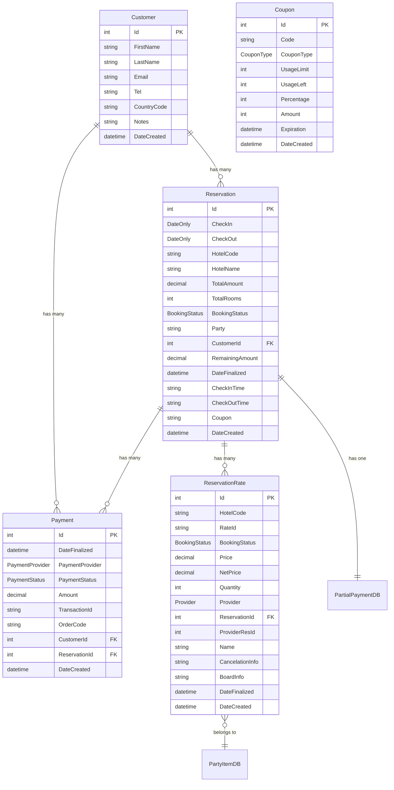
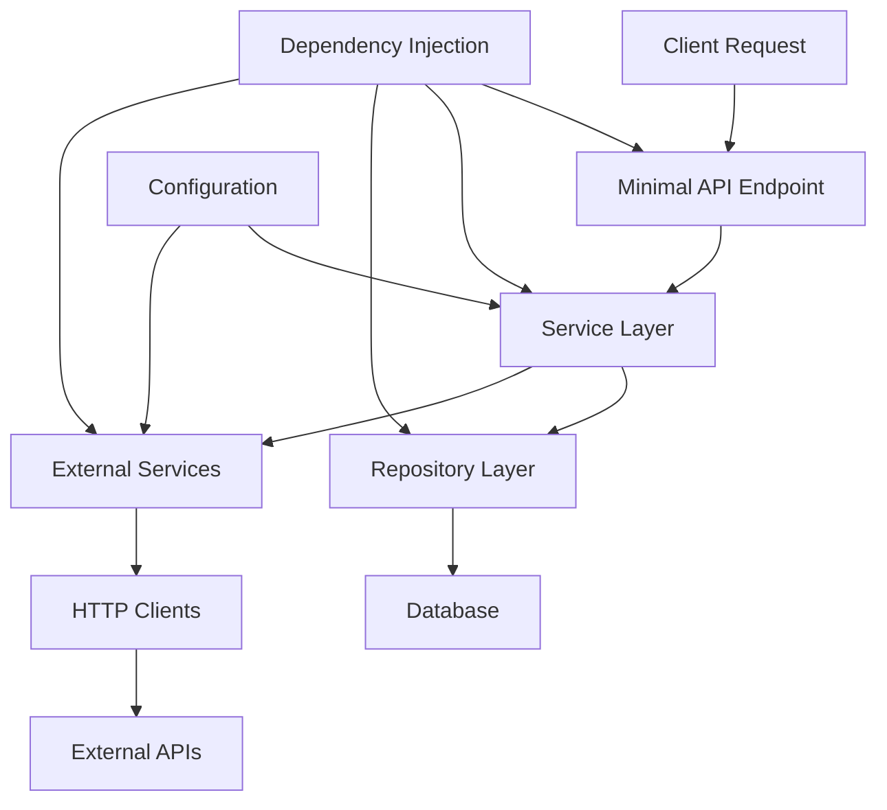

# TravelBridge API Architecture

## Overview
TravelBridge is a travel booking API built with ASP.NET Core (.NET 9) that provides hotel search, booking, and payment processing capabilities. The application follows a layered architecture pattern with clear separation of concerns and integrates with multiple external services for comprehensive travel services.

## Project Structure

### Solution Organization
```
TravelBridge/
├── TravelBridge.API/           # Main API application
├── TravelBridge.Common/        # Shared common utilities  
├── TravelBridge.Models/        # Shared models library
└── TravelBridge.sln           # Solution file
```

### TravelBridge.API Structure
```
TravelBridge.API/
├── Contracts/                 # API contracts and interfaces
├── DataBase/                  # Entity Framework DbContext
├── Endpoints/                 # Minimal API endpoint definitions
├── Helpers/                   # Utility classes and extensions
├── Migrations/                # Entity Framework migrations
├── Models/                    # Data models organized by purpose
│   ├── Apis/                 # External API configuration models
│   ├── DB/                   # Database entity models
│   ├── ExternalModels/       # External service DTOs
│   ├── Plugin/               # Plugin-specific models
│   └── WebHotelier/          # WebHotelier service models
├── Properties/               # Assembly properties
├── Repositories/             # Data access layer
├── Resources/                # Static resources (email templates)
├── Services/                 # Business logic services
│   ├── ExternalServices/     # External API integrations
│   ├── Viva/                # Viva payments integration
│   └── WebHotelier/         # WebHotelier integration
├── Program.cs               # Application entry point and DI configuration
├── appsettings.json         # Configuration settings
└── TravelBridge.API.csproj  # Project file
```

## What Each Part Does

### **Contracts/** 
Contains API contracts, interfaces, and response models that define the shape of data exchanged between different layers:
- `AutoCompleteResponse.cs` - Hotel/location autocomplete responses
- `BookingResponse.cs` - Booking operation responses
- `CheckoutResponse.cs` - Checkout information responses
- `PluginSearchResponse.cs` - Search plugin responses
- `IParty.cs` - Interface for party/guest information

### **DataBase/**
- `AppDbContext.cs` - Entity Framework Core database context that manages all database operations and defines entity relationships

### **Endpoints/**
Minimal API endpoint definitions organized by functionality:
- `SearchPluginEndpoints.cs` - Hotel search and autocomplete endpoints
- `HotelEndpoint.cs` - Hotel information and availability endpoints  
- `ReservationEndpoints.cs` - Booking and reservation management endpoints

### **Services/**
Business logic layer organized by domain:

#### **ExternalServices/**
- `HereMapsService.cs` - Location search and geocoding via HERE Maps API
- `MapBoxService.cs` - Map services and location data via MapBox API

#### **Viva/**
- `VivaService.cs` - Payment processing via Viva Wallet
- `VivaAuthService.cs` - Authentication management for Viva API

#### **WebHotelier/**
- `WebHotelierPropertiesService.cs` - Hotel inventory and booking management via WebHotelier API

### **Repositories/**
Data access layer:
- `ReservationsRepository.cs` - Database operations for reservations, customers, and payments

### **Models/**
Organized data models:

#### **DB/** - Database Entities
- `BaseModel.cs` - Base entity with common properties (Id, DateCreated)
- `Customer.cs` - Customer information
- `Reservation.cs` - Hotel reservations  
- `ReservationRate.cs` - Room rates within reservations
- `Payment.cs` - Payment transactions
- `Coupon.cs` - Discount coupons

#### **Apis/** - External API Configuration
- Configuration classes for HERE Maps, MapBox, Viva, and WebHotelier APIs

### **Helpers/**
Utility functions and extensions:
- `Extensions/` - Extension methods
- `Converters/` - Data conversion utilities
- `General.cs` - General utility functions

## Database Model Relations (AppDbContext.cs)

### Entity Relationships



### Key Relationships
1. **Customer ⇄ Reservation (One-to-Many)**: A customer can have multiple reservations
2. **Customer ⇄ Payment (One-to-Many)**: A customer can have multiple payments  
3. **Reservation ⇄ Payment (One-to-Many)**: A reservation can have multiple payments (partial payments)
4. **Reservation ⇄ ReservationRate (One-to-Many)**: A reservation contains multiple room rates

### Database Configuration
- **Database**: MariaDB (MySQL compatible)
- **Charset**: UTF8MB4 for Greek and Latin character support
- **Timestamps**: CURRENT_TIMESTAMP default for all DateCreated fields
- **Delete Behavior**: 
  - Restrict on Customer relations (prevent accidental deletion)
  - Cascade on ReservationRate (delete rates when reservation is deleted)

## Service Layers

### Dependency Injection Architecture
Services are registered in `Program.cs` with scoped lifetime:

```csharp
// External Services
builder.Services.AddScoped<HereMapsService>();
builder.Services.AddScoped<MapBoxService>();
builder.Services.AddScoped<WebHotelierPropertiesService>();

// Payment Services  
builder.Services.AddScoped<VivaService>();
builder.Services.AddScoped<VivaAuthService>();

// Repository Layer
builder.Services.AddScoped<ReservationsRepository>();

// API Endpoints
builder.Services.AddScoped<SearchPluginEndpoints>();
builder.Services.AddScoped<HotelEndpoint>();
builder.Services.AddScoped<ReservationEndpoints>();
```

### Service Dependencies

#### **WebHotelierPropertiesService**
- **Purpose**: Primary hotel inventory management
- **Dependencies**: IHttpClientFactory (WebHotelierApi client)
- **Functions**: Hotel search, availability checking, booking creation

#### **VivaService** 
- **Purpose**: Payment processing
- **Dependencies**: VivaAuthService, IHttpClientFactory (VivaApi client)
- **Functions**: Payment order creation, payment validation

#### **VivaAuthService**
- **Purpose**: OAuth2 authentication for Viva payments
- **Dependencies**: HttpClient, VivaApiOptions
- **Functions**: Token management, authentication

#### **HereMapsService**
- **Purpose**: Location search and geocoding
- **Dependencies**: IHttpClientFactory (HereMapsApi client)
- **Functions**: Location autocomplete, geocoding

#### **MapBoxService**
- **Purpose**: Map services and location data
- **Dependencies**: IHttpClientFactory (MapBoxApi client)
- **Functions**: Map-based location services

#### **ReservationsRepository**
- **Purpose**: Data access for reservations
- **Dependencies**: AppDbContext
- **Functions**: CRUD operations for reservations, customers, payments

## Testing Framework

**Current State**: No testing framework is currently implemented in the solution.

**Recommendation**: Consider adding:
- `TravelBridge.Tests` project with xUnit/NUnit
- Integration tests for API endpoints
- Unit tests for service layer
- Repository pattern testing with in-memory database

## Where State Lives & How Services Connect

### State Management

#### **Database State** (via Entity Framework Core)
- **Customer data**: Names, contact information, preferences
- **Reservation data**: Booking details, dates, hotel information  
- **Payment data**: Transaction records, payment status
- **Rate data**: Room pricing and availability information

#### **HTTP Client State** (via IHttpClientFactory)
- **Configured HTTP clients** for each external service:
  - `HereMapsApi` - HERE Maps integration
  - `MapBoxApi` - MapBox integration  
  - `VivaApi` - Viva Wallet payments
  - `WebHotelierApi` - Hotel inventory system

#### **Authentication State** (in-memory)
- **Viva OAuth tokens**: Cached in VivaAuthService with expiration tracking
- **API keys**: Stored in configuration for external services

### Service Connection Flow



### Configuration Management
All external service configurations are stored in `appsettings.json`:
- **Connection strings**: MariaDB database connection
- **API credentials**: Keys and secrets for external services  
- **Service URLs**: Base URLs for all external APIs
- **Application settings**: Logging levels, CORS policies

### Middleware Pipeline
1. **Response Compression**: GZIP compression for HTTPS
2. **CORS**: Allow all origins policy  
3. **Request/Response Logging**: Custom middleware for request/response body logging
4. **Swagger/OpenAPI**: API documentation and testing interface

### Error Handling & Logging
- **Serilog**: Structured logging to console and file
- **File logging**: Rolling files (50MB max, 10 file retention)
- **Request/Response logging**: Full request/response body logging for debugging

## External Integrations

### HERE Maps API
- **Purpose**: Location search and geocoding
- **Authentication**: API Key
- **Usage**: Hotel and location autocomplete functionality

### MapBox API  
- **Purpose**: Map services and location data
- **Authentication**: API Key
- **Usage**: Geographic services and mapping

### Viva Wallet API
- **Purpose**: Payment processing
- **Authentication**: OAuth2 with client credentials
- **Usage**: Payment order creation and transaction validation

### WebHotelier API
- **Purpose**: Hotel inventory and booking management
- **Authentication**: Basic Authentication (username/password)
- **Usage**: Hotel search, availability, booking creation

## Technology Stack

- **.NET 9**: Runtime and framework
- **ASP.NET Core**: Web framework with Minimal APIs
- **Entity Framework Core**: ORM for database operations
- **Pomelo.EntityFrameworkCore.MySql**: MySQL/MariaDB provider
- **Serilog**: Structured logging
- **Swagger/OpenAPI**: API documentation
- **System.Text.Json**: JSON serialization
- **HttpClientFactory**: HTTP client management

## Architecture Benefits

1. **Separation of Concerns**: Clear layering between API, business logic, and data access
2. **Dependency Injection**: Loose coupling and testability through DI container
3. **Configuration Management**: Centralized configuration with strong typing
4. **HTTP Client Management**: Proper HTTP client lifecycle management
5. **Minimal APIs**: Lightweight endpoint definitions without MVC overhead
6. **Entity Framework**: Type-safe database operations with migrations
7. **Structured Logging**: Comprehensive logging for debugging and monitoring
8. **External Service Integration**: Clean abstraction of external dependencies